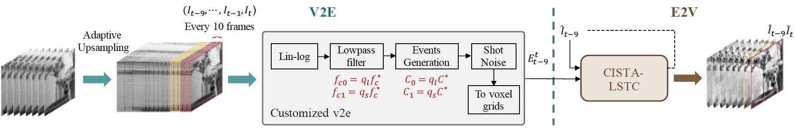

# V2E2V: Video-to-events-to-video framework
This repository is related to the TPAMI paper [Sensing Diversity and Sparsity Models for Event Generation and Video Reconstruction from Events](https://ieeexplore.ieee.org/abstract/document/10130595) and the preliminary work in the ICASSP paper [Convolutional ISTA Network with Temporal Consistency Constraints for Video Reconstruction from Event Cameras](https://ieeexplore.ieee.org/abstract/document/9746331). This is the Python torch code for Video-to-events-to-video (V2E2V) framework, including E2V reconstruction networks [CISTA-LSTC](https://ieeexplore.ieee.org/abstract/document/10130595) / [CISTA-TC](https://ieeexplore.ieee.org/abstract/document/9746331).

This code includes two parts: Events-to-video (E2V) reconstruction and video-to-events (V2E) generation. For the E2V reconstruction, a convolutional ISTA network (CISTA) is designed based on sparse representation models and the algorithm unfolding strategy. Long short-term temporal consistency (LSTC) constraints are further introduced to enhance the temporal coherence. In the V2E generation, we introduce the idea of having interleaved pixels with different contrast threshold and lowpass bandwidth and conjecture that this can help extract more useful information from intensity. Finally, V2E2V architecture is used to validate how alternative event generation strategies improve video reconstruction. 



## Requirements
Perceptual loss [LPIPS](https://github.com/richzhang/PerceptualSimilarity) and [pytorch_msssim](https://github.com/VainF/pytorch-msssim) are required.

    torch==1.13.1
    torchvision==0.14.1
    lpips==0.1.2
    numpy==1.24.3
    opencv_contrib_python==4.5.3.56
    opencv_python==4.5.5.62
    pytorch_msssim==0.2.1
    scikit_image==0.18.3


## E2V: CISTA-LSTC Network
The reconstruction networks are under the folder named e2v. Use ```train_e2v.py``` and ```test_e2v.py``` to train and test the model.

### Training
An example of training E2V model.
    
    python train_e2v.py \
    --path_to_train_data $path_to_train_data \
    --model_name "RecNet" \
    --model_mode "cista-lstc" \
    --batch_size 1 --epochs 60 --lr 1e-4 \
    --len_sequence 15 \
    --num_bins 5 \
    --depth 5 --base_channels 64 \
    --num_events 15000 \

### Testing
```test_data_mode='real'``` for [HQF](https://timostoff.github.io/20ecnn) and [ECD](https://rpg.ifi.uzh.ch/davis_data.html) data sequences, and ```test_data_mode='upsampled'``` for simulated data sequences.
    
    python test_e2v.py \
    --path_to_test_model pretrained/RecNet_cista-lstc.pth.tar \
    --path_to_test_data data_examples/ECD \
    --data_type 'image_reader' \
    --model_mode "cista-lstc" \
    --test_data_mode 'real' \
    --num_events 15000 \
    --test_data_name slider_depth \

## V2E: Sensing Diversity in Event Generation
The code for new V2E generation is under the folder of v2e. This part is modified from [v2e](https://github.com/SensorsINI/v2e). Note that the input must be high frame rate video sequences in order to generate events, otherwise video interpolation is required. Here we use [adaptive upsampling](https://github.com/uzh-rpg/rpg_vid2e/tree/master/upsampling) based on [Super-Slomo](https://jianghz.me/projects/superslomo/). The checkpoint of Super-Slomo model is downloaded from [here](https://drive.google.com/file/d/1YL2EnX0MsrH_5_PjhDr__c6NaT_y8I7Z/view?usp=sharing).

## V2E2V framework
Once the E2V network is trained with normal events, we can further train it with the new events generated by V2E. The V2E2V architecture is ```model_v2e2v.py```. The v2e2v model takes HFR intensity video sequences as input and output reconstructed frames.

### Training
An example to train the E2V model with the new events. ```path_to_e2v``` is the path to the pretrained E2V model.```num_pack_frames``` determines how many HFR frames are used to generate events for one reconstruction.

    python train.py \
    --path_to_train_data $path_to_train_data \
    --path_to_e2v pretrained/RecNet_cista-lstc.pth.tar \
    --model_name "V2E2V" \
    --image_dim 180 240 \
    --num_pack_frames 10 \
    -s 15 \
    --C 0.6 \
    --pl 1.5 --ps 0.5 \
    --cutoff_hz 200 \
    --ql 1 --qs 0 \
    --refractory_period_s 0.001 \
    --epochs 1 \
    
### Testing
An example to run the V2E2V model to test the reconstruction results based on new events. Specify ```data_type``` for different input data format (video or images, LFR or HFR), ```data_type='video'/'image_reader'/'upsampling'```. For real LFR video sequences, ```data_type='upsampling'``` while ```data_type='image_reader'``` for simulated HFR video sequences.

    python test.py \
    --path_to_test_model pretrained/V2E2V_C0.6_1.5_0.5_fc200.0_1.0_0.0.pth.tar \
    --data_type upsampling \
    --path_to_test_data data_examples/HQF \
    --num_pack_frames 10 \
    --test_data_name still_life \
    --test_img_num 300 \
    
## Dataset
We train and test our networks on simulated dataset. They can also work on real dataset [HQF](https://timostoff.github.io/20ecnn) and [ECD](https://rpg.ifi.uzh.ch/davis_data.html) data sequences.

Examples of test data can be downloaded [here](https://drive.google.com/drive/folders/1xDJMZdE7rQXYe8hdMMxYnD6gjpBdgyY2?usp=sharing). Consult the [README](data_examples/README.md) for details. 


## Citation
If you use any of this code, please cite the publications as follows:
```bibtex
    @article{liu_sensing_2023,  
    title={Sensing Diversity and Sparsity Models for Event Generation and Video Reconstruction from Events},   
    author={Liu, Siying and Dragotti, Pier Luigi},  
    journal={IEEE Transactions on Pattern Analysis and Machine Intelligence},  
    year={2023},  
    pages={1-16},  
    publisher={IEEE}. 
    doi={10.1109/TPAMI.2023.3278940}. 
    }
```
```bibtex
    @inproceedings{liu_convolutional_2022,  
    title={Convolutional ISTA Network with Temporal Consistency Constraints for Video Reconstruction from Event Cameras},  
    author={Liu, Siying and Alexandru, Roxana and Dragotti, Pier Luigi},  
    booktitle={ICASSP 2022-2022 IEEE International Conference on Acoustics, Speech and Signal Processing (ICASSP)},  
    pages={1935--1939},  
    year={2022},  
    organization={IEEE}. 
    doi={10.1109/ICASSP43922.2022.9746331}. 
    }
```
